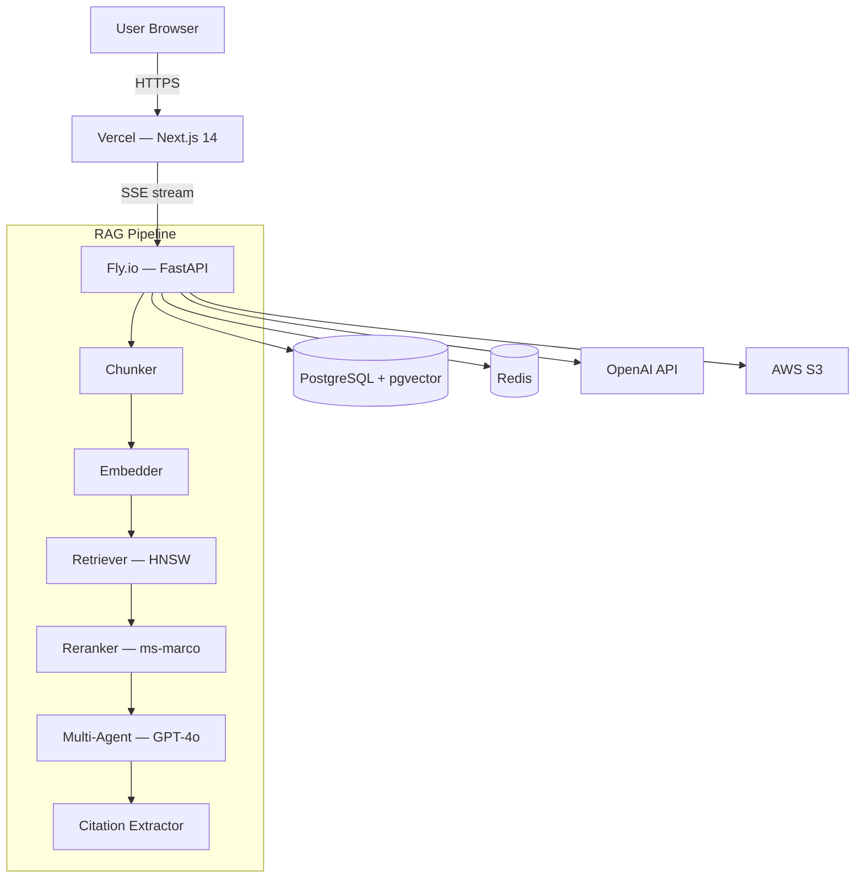

# RAG Document Intelligence

> AI-powered document Q&A with verifiable citations. Upload PDFs, DOCX, TXT, or Markdown — ask anything — every answer traces back to exact pages and paragraphs.

**Live demo:** _deploy and add URL here_

---

## Architecture



---

## Tech Stack

| Layer | Technology |
|---|---|
| Frontend | Next.js 14 App Router, TypeScript, Tailwind CSS, shadcn/ui |
| State | Zustand + TanStack Query v5 |
| Auth | NextAuth.js (GitHub OAuth + magic link) |
| Backend | FastAPI, Python 3.11, asyncio |
| Database | PostgreSQL 16 + pgvector (HNSW index) |
| Embeddings | OpenAI text-embedding-3-small (1536-dim) |
| LLM | GPT-4o with structured citation markers |
| Reranker | ms-marco-MiniLM-L-6-v2 cross-encoder |
| Deploy | Vercel (frontend) + Fly.io (backend) |
| CI/CD | GitHub Actions |

---

## Quick Start

### Prerequisites
- Node.js 20+, Python 3.11+, Docker

### 1. Clone and configure
```bash
git clone https://github.com/RuphakVarmaa/rag-doc-intelligence
cd rag-doc-intelligence
cp .env.example .env
# Fill in: OPENAI_API_KEY, GITHUB_CLIENT_ID/SECRET, NEXTAUTH_SECRET, RESEND_API_KEY
```

### 2. Start infrastructure
```bash
docker compose up -d postgres redis
```

### 3. Run migrations
```bash
cd backend
pip install -r requirements-dev.txt
alembic upgrade head
```

### 4. Start backend
```bash
uvicorn app.main:app --reload --port 8000
```

### 5. Start frontend
```bash
cd frontend
npm install
npm run dev
# → http://localhost:3000
```

---

## Environment Variables

| Variable | Description |
|---|---|
| `DATABASE_URL` | PostgreSQL connection string (asyncpg) |
| `OPENAI_API_KEY` | OpenAI API key for embeddings + chat |
| `NEXTAUTH_SECRET` | Random secret for NextAuth (`openssl rand -base64 32`) |
| `NEXTAUTH_URL` | Public URL of the frontend |
| `GITHUB_CLIENT_ID` | GitHub OAuth App client ID |
| `GITHUB_CLIENT_SECRET` | GitHub OAuth App client secret |
| `RESEND_API_KEY` | Resend API key for magic link emails |
| `STORAGE_BUCKET` | AWS S3 bucket name |
| `AWS_ACCESS_KEY_ID` | AWS access key |
| `AWS_SECRET_ACCESS_KEY` | AWS secret key |
| `AWS_REGION` | AWS region (default: us-east-1) |
| `SENTRY_DSN` | Sentry DSN for error tracking |
| `BACKEND_URL` | Backend service URL |

---

## API Reference

| Method | Endpoint | Description |
|---|---|---|
| `POST` | `/api/documents/upload` | Upload document (multipart) |
| `GET` | `/api/documents/{id}/status` | SSE stream: processing status |
| `GET` | `/api/documents` | List all documents |
| `DELETE` | `/api/documents/{id}` | Soft-delete document |
| `POST` | `/api/chat/stream` | SSE stream: RAG chat response |
| `GET` | `/api/chat/sessions` | List chat sessions |
| `DELETE` | `/api/chat/sessions/{id}` | Delete session |
| `POST` | `/api/embeddings/{id}/reembed` | Re-trigger embedding |
| `GET` | `/health` | Health check |
| `GET` | `/ready` | Readiness check |

---

## Deployment

### Backend → Fly.io
```bash
cd backend
flyctl auth login
flyctl launch --name rag-doc-backend
flyctl secrets set OPENAI_API_KEY=... DATABASE_URL=... NEXTAUTH_SECRET=...
flyctl deploy
```

### Frontend → Vercel
```bash
cd frontend
npx vercel --prod
# Set env vars in Vercel dashboard
```

### GitHub Actions Secrets Required
```
FLY_API_TOKEN
VERCEL_TOKEN
VERCEL_ORG_ID
VERCEL_PROJECT_ID
```

---

## Running Tests

```bash
# Backend
cd backend
pytest --cov=app --cov-report=term-missing

# Frontend unit
cd frontend
npx vitest run

# Frontend E2E
npx playwright test
```

---

## Project Structure

```
rag-doc-intelligence/
├── frontend/                  # Next.js 14 App Router
│   ├── app/                   # Pages and layouts
│   ├── components/            # UI components
│   │   ├── chat/              # Chat panel, bubbles
│   │   ├── citations/         # Citations panel
│   │   ├── documents/         # Document sidebar
│   │   └── ui/                # Shared primitives
│   ├── store/                 # Zustand stores
│   └── hooks/                 # Custom React hooks
├── backend/                   # FastAPI service
│   └── app/
│       ├── routers/           # HTTP route handlers
│       ├── services/          # Business logic (RAG pipeline)
│       ├── models/            # SQLAlchemy ORM models
│       └── db/migrations/     # Alembic migrations
├── docker-compose.yml         # Local dev infrastructure
├── .github/workflows/ci.yml   # CI/CD pipeline
└── docs/spec.md               # Full system specification
```

---

Built by [Ruphak Varmaa S](https://ruphak.me)
