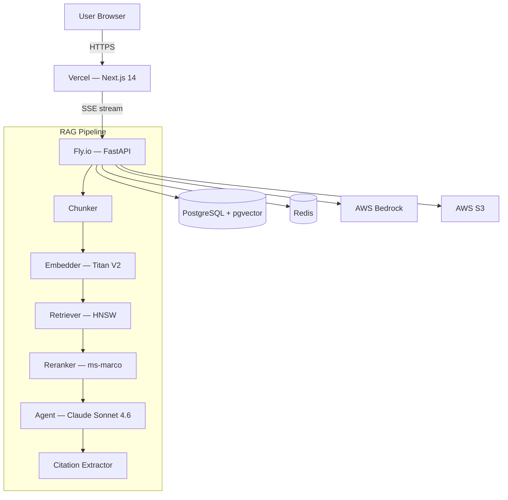

# RAG Document Intelligence

> AI-powered document Q&A with verifiable citations. Upload PDFs, DOCX, TXT, or Markdown — ask anything — every answer traces back to exact pages and paragraphs.

**Live frontend:** https://frontend-nu-three-92.vercel.app
**GitHub:** https://github.com/RuphakVarmaa/rag-doc-intelligence

---

## Architecture



---

## Tech Stack

| Layer | Technology |
|---|---|
| Frontend | Next.js 14 App Router, TypeScript, Tailwind CSS |
| State | Zustand + TanStack Query v5 |
| Auth | NextAuth.js (GitHub OAuth + magic link), HS256 JWT bridge |
| Backend | FastAPI, Python 3.11, asyncio |
| Database | PostgreSQL 16 + pgvector (HNSW index, 1024-dim) |
| Embeddings | Amazon Titan Text V2 via AWS Bedrock |
| LLM | Claude Sonnet 4.6 (chat) + Claude Haiku 4.5 (query routing) |
| Reranker | ms-marco-MiniLM-L-6-v2 cross-encoder |
| Deploy | Vercel (frontend) + Fly.io (backend) |
| CI/CD | GitHub Actions |

---

## Live Links

| Service | URL |
|---|---|
| Frontend (Vercel) | https://frontend-nu-three-92.vercel.app |
| GitHub repo | https://github.com/RuphakVarmaa/rag-doc-intelligence |
| Vercel dashboard | https://vercel.com/ruphakvarmaas-projects/frontend |
| Backend (Fly.io) | https://rag-doc-backend.fly.dev _(deploy with `flyctl deploy`)_ |

---

## Quick Start

### Prerequisites
- Node.js 20+, Python 3.11+, Docker

### 1. Clone and configure
```bash
git clone https://github.com/RuphakVarmaa/rag-doc-intelligence
cd rag-doc-intelligence
cp .env.example .env
# Fill in: AWS_ACCESS_KEY_ID, AWS_SECRET_ACCESS_KEY, GITHUB_CLIENT_ID/SECRET, NEXTAUTH_SECRET
```

### 2. Start infrastructure
```bash
docker compose up -d postgres redis
```

### 3. Run migrations
```bash
cd backend
pip install -r requirements-dev.txt
alembic upgrade head
```

### 4. Start backend
```bash
uvicorn app.main:app --reload --port 8000
```

### 5. Start frontend
```bash
cd frontend
npm install
npm run dev
# → http://localhost:3000
```

---

## Environment Variables

| Variable | Description |
|---|---|
| `DATABASE_URL` | PostgreSQL connection string (asyncpg) |
| `AWS_ACCESS_KEY_ID` | AWS access key (Bedrock + S3) |
| `AWS_SECRET_ACCESS_KEY` | AWS secret key |
| `AWS_REGION` | AWS region (default: `us-east-1`) |
| `STORAGE_BUCKET` | AWS S3 bucket name for file storage |
| `NEXTAUTH_SECRET` | Random secret (`openssl rand -base64 32`) |
| `NEXTAUTH_URL` | Public URL of the frontend |
| `GITHUB_CLIENT_ID` | GitHub OAuth App client ID |
| `GITHUB_CLIENT_SECRET` | GitHub OAuth App client secret |
| `RESEND_API_KEY` | Resend API key for magic link emails |
| `SENTRY_DSN` | Sentry DSN for error tracking |
| `BACKEND_URL` | Backend service URL |

---

## API Reference

| Method | Endpoint | Description |
|---|---|---|
| `POST` | `/api/documents/upload` | Upload document (multipart) |
| `GET` | `/api/documents` | List all documents |
| `GET` | `/api/documents/{id}` | Get document metadata + file URL |
| `GET` | `/api/documents/{id}/status` | SSE stream: processing status |
| `GET` | `/api/documents/{id}/file` | Serve raw file bytes (or S3 redirect) |
| `DELETE` | `/api/documents/{id}` | Soft-delete document |
| `POST` | `/api/chat/stream` | SSE stream: RAG chat response |
| `GET` | `/api/chat/sessions` | List chat sessions |
| `DELETE` | `/api/chat/sessions/{id}` | Delete session |
| `POST` | `/api/embeddings/{id}/reembed` | Re-trigger embedding |
| `GET` | `/health` | Health check |
| `GET` | `/ready` | Readiness check |

---

## Deployment

### Backend → Fly.io
```bash
cd backend
flyctl auth login
flyctl launch --name rag-doc-backend
flyctl secrets set \
  AWS_ACCESS_KEY_ID=... \
  AWS_SECRET_ACCESS_KEY=... \
  DATABASE_URL=... \
  NEXTAUTH_SECRET=...
flyctl deploy
```

### Frontend → Vercel
```bash
cd frontend
npx vercel --prod
# Set env vars in Vercel dashboard → Settings → Environment Variables
```

### GitHub Actions Secrets Required
```
FLY_API_TOKEN
VERCEL_TOKEN
VERCEL_ORG_ID
VERCEL_PROJECT_ID
```

---

## Running Tests

```bash
# Backend
cd backend
pytest --cov=app --cov-report=term-missing

# Frontend unit
cd frontend
npx vitest run

# Frontend E2E
npx playwright test
```

---

## Project Structure

```
rag-doc-intelligence/
├── frontend/                  # Next.js 14 App Router
│   ├── app/                   # Pages and layouts
│   │   ├── dashboard/         # Main chat + document interface
│   │   ├── upload/            # Drag-and-drop upload with SSE progress
│   │   ├── documents/[id]/    # PDF viewer with right-click "Ask about this"
│   │   └── auth/              # Sign-in and error pages
│   ├── components/
│   │   ├── chat/              # ChatPanel, ChatBubble (streaming)
│   │   ├── citations/         # Citations panel with confidence badges
│   │   ├── documents/         # Document sidebar with status indicators
│   │   └── error/             # ErrorBoundary
│   ├── store/                 # Zustand (chat, document, ui state)
│   └── lib/                   # API client (HS256 JWT injection), auth config
├── backend/                   # FastAPI service
│   └── app/
│       ├── routers/           # documents, chat, embeddings
│       ├── services/          # chunker, embedder, retriever, reranker, agent, citation
│       ├── models/            # SQLAlchemy ORM (Document, Chunk, ChatSession)
│       └── db/migrations/     # Alembic (pgvector 1024-dim HNSW index)
├── docker-compose.yml         # Local dev: pgvector + redis
├── .github/workflows/ci.yml   # lint → typecheck → test → deploy
└── docs/spec.md               # Full system specification
```

---

Built by [Ruphak Varmaa S](https://github.com/RuphakVarmaa)
